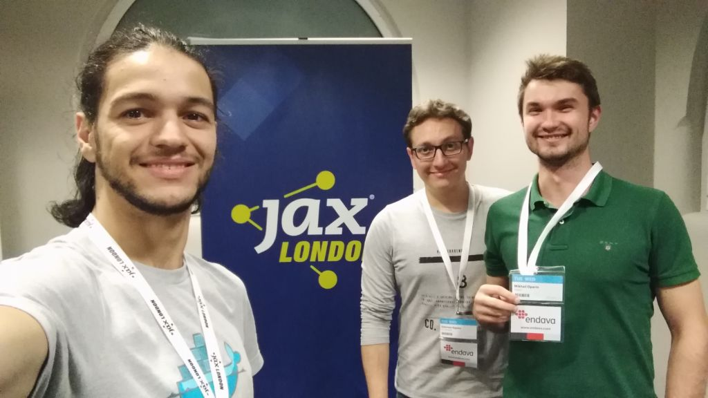
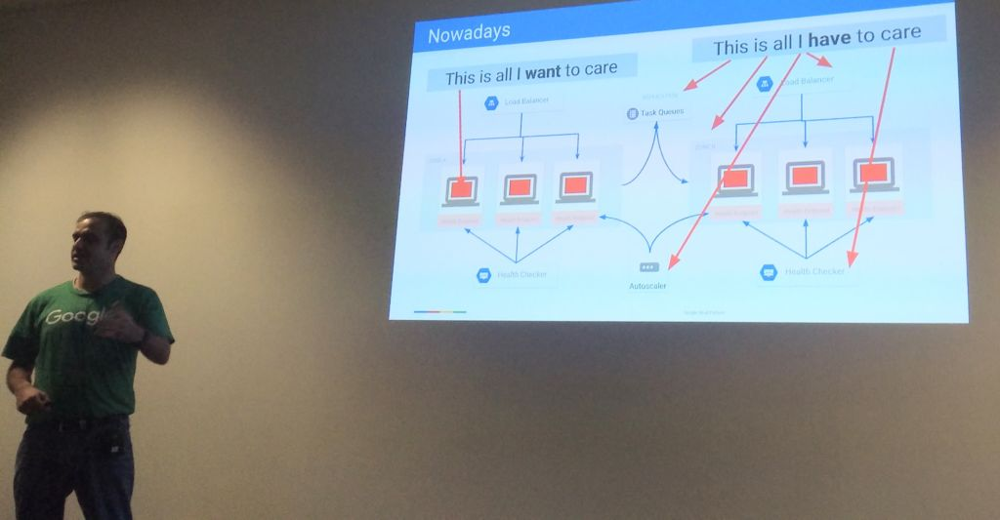
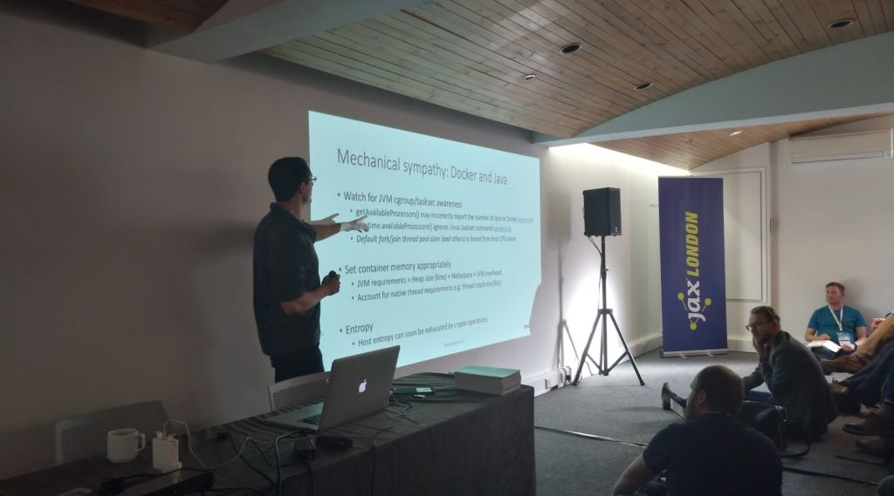
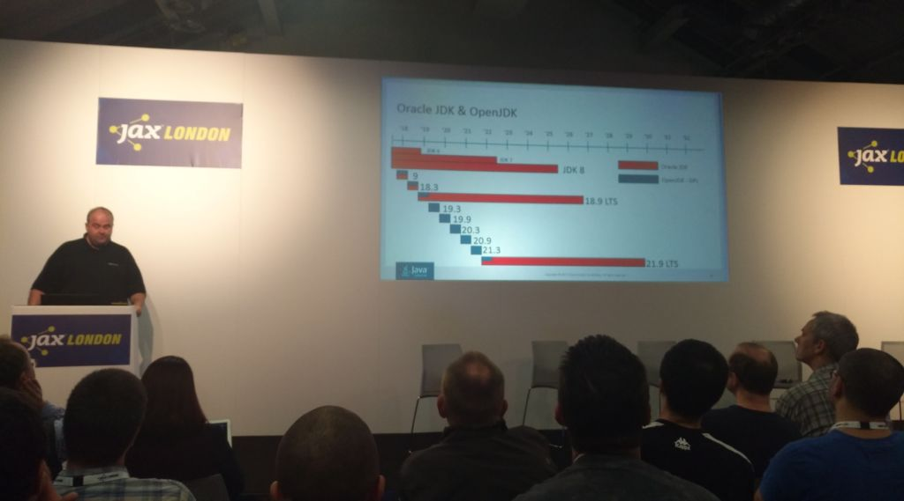

> Originally published at [foodora/foodpanda tech blog](https://tech.foodora.com/jax-london-2017/)

In October 2017 some of the top tech companies got together in the JAX London a conference about JAVA, microservices, continuous delivery and DevOps, and foodora tech was also there to check the latest releases and trends for the future of JAVA.

After 2 days, 13 presentations and lot's of coffee we returned home with a few new concepts, t-shirts, stickers and the awareness that foodora is in the selected group of companies which attended the event that is using almost all the cutting-edge technologies that were discussed at the event.

## Highlights

[@meteatamel](https://twitter.com/meteatamel) Google Developer Advocate guided us into a tour on the architecture of resilient microservices with Kubernetes, the managed kubernetes that [Google Cloud Engine (GKE)](https://cloud.google.com/kubernetes-engine/) offers is extremely easy to setup and might be a good option for small teams that doesn't have System Engineers to manage a cluster. At foodora nothing new there since we are already using this architecture since January 2017,  but the presentation was a nice review and reaffirms that we are going in the right direction.

[@danielbryantuk](https://twitter.com/danielbryantuk) consultant and author of the book Containerizing Continuous Delivery in Java (O'REILLY, 2018) reviewed the flows of CI/CD and discussed the particularities of Java and containers, Oracle is going all in supporting containerized apps with Java 9, the ability of run an optimized JRE with only the resources that your application needs is on our way (see java 9 modules)

[@DonaldOJDK](https://twitter.com/DonaldOJDK) Senior Director of Product Management for Oracle talked about the new release cycles of java and how the language will move forward faster than ever with a new release each 6 months. There will be versions that will not be maintained for longer which will force the companies that choose this path to always upgrade the java version of their projects, but if your company is more conservative you still have the option to stay in the versions that are long time supported.

It's a common agreement that our team would enjoy it more if the speakers had dive deep into the topics, but it's also understandable that due to the small duration of the sessions it's challenging to do so. Now it's time to share the knowledge internally with teams and prepare towards the future of fast pace java releases.

Happy coding.