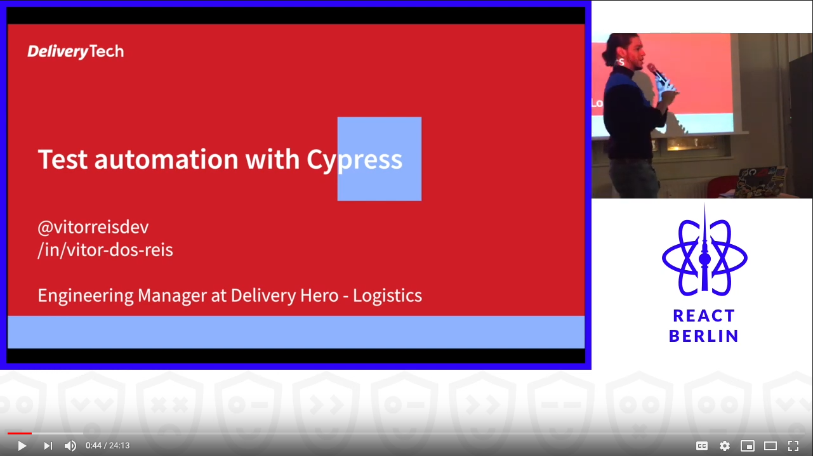

Testes manuais é uma das coisas mais dolorosas no ciclo de vida de desenvolvimento de software, conforme os produtos evolvem a emais functionalidades são adicionadas o tamanho do código fonte tende a crescer, se o seu produto está tendo sucesso o seu time pode crescer e com isso o risco de introduzir regressões é ainda maior.

## O que faz um biblioteca de testes ser boa?
Em poucas palavras, deve ser simples de:
- Configurar testes
- Escrever testes
- Executar testes
- Depurar

## Estrategias para testes

Existem muitas estrategias para automação de testes, as mais populares sendo:

#### 1. Stub Requests
Pros
- Rápido / fácil e flexível
- Não depende de servidores ou banco de dados

Contras
- Não é "e2e" de verdade
- Precisa "Fixtures"

#### 2. Static User
Pros
- Realmente cria uma sessão E2E

Contras
- Precisa de servidor
- Inicialização de banco de dados
- Testes compartilham estado

#### 3. Dynamic User
Pros
- Não existe mutação de estado
- Flexível / Poderosa

Contras
- Configuração de banco de dados / Remoção
- Devagar / Complexa

## A Solução da biblioteca Cypress

Em 2019 eu dei uma palestra para a comunidade de React de Berlim em que em menos de 25 minutos eu discuti problemas comuns, soluções e como Cypress permite você implementar automação "e2e" para aplicações web de um jeito simples, rápido e facíl de dar manutenção.

Video: Test automation with cypress, React Berlin November, 2019

## Referências
- Cypress - [Test a React Todo App](https://docs.cypress.io/examples/examples/tutorials.html#Test-a-React-Todo-App)
- Brian Mann – [I see your point, but…  - AssertJS 2018](https://www.youtube.com/watch?v=5XQOK0v_YRE)
