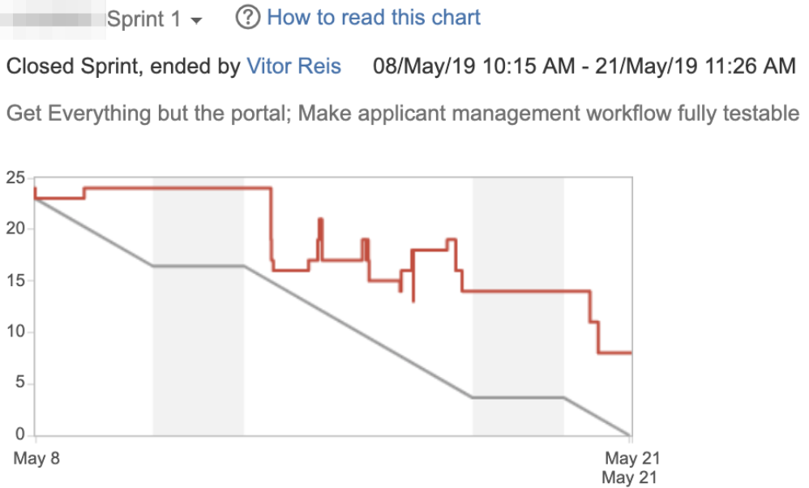
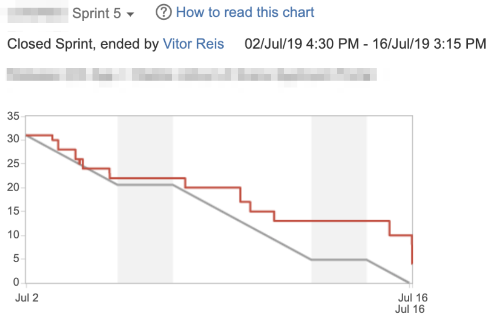
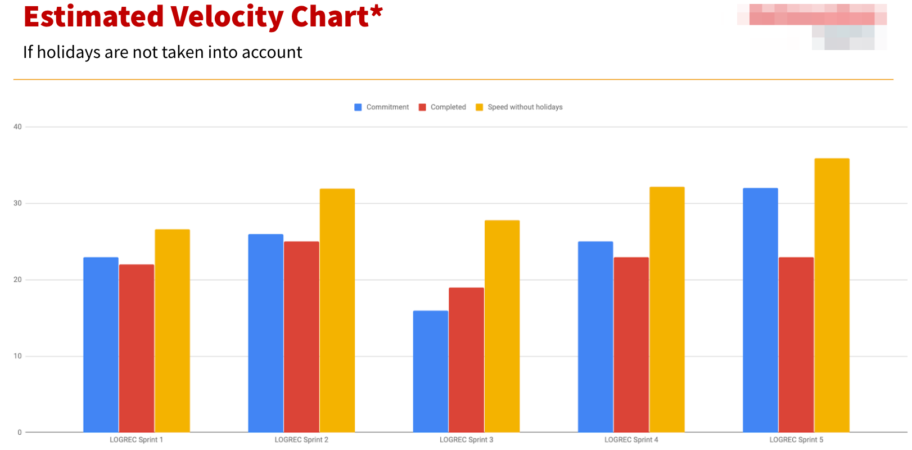

## Background

On Q3 2018 I started on the journey of building a new cross-functional team for a greenfield project. We started it with a product manager and me as lead engineer, a few months down the road we had a 2nd engineer working with us in our HQ in Berlin and a 3rd engineer working remote from South America while his visa was being processed. In the beginning we didn't feel the need of having a specific process, we used a kanban board to prioritise and track progress on development.

As the team continued to grow and our remote engineer relocated to Berlin joining us in our headquarter we started having a feeling that we could be more productive.

Reflecting on the topic with fellow colleagues and our senior management we decided to address this situation by changing our software development process, the main reasons for this change were:

- Anticipation of team growth
- Feeling that we could be more efficient
- No metrics for tracking team performance
- We were looking for a more efficient way of getting things done
- Mentoring available

## Is Scrum the way to go?

I first heard of Scrum at University in 2012, the topic was really interesting to me; I studied and obtained a certification of "Professional Scrum Master", however many companies that I worked didn't use Scrum and many others used what they described as "Scrum-like", which means that they tailored Scrum to the needs and reality of the company. I ended up learning that many times that can completely twist the process and can kill many of the benefits of Scrum.

## Scrum Theory 

Scrum is founded on empirical process control theory, or empiricism. Empiricism asserts that knowledge comes from experience and making decisions based on what is known. Scrum employs an iterative, incremental approach to optimize predictability and control risk (Schwaber and Sutherland, 2017).

Three pillars uphold every implementation of empirical process control:

- Transparency
- Inspection
- Adaptation

### Transparency

Significant aspects of the process must be visible to those responsible for the outcome.

Transparency requires those aspects be defined by a common standard so observers share a common understanding of what is being seen.

For example
- A common language referring to the process must be shared by all participants; and,
- Those performing the work and those inspecting the resulting increment must share a common definition of “Done”.

### Inspection

Scrum users must frequently inspect Scrum artifacts and progress toward a Sprint Goal to detect undesirable variances. Their inspection should not be so frequent that inspection gets in the way
of the work. Inspections are most beneficial when diligently performed by skilled inspectors at
the point of work.

### Adaptation

If an inspector determines that one or more aspects of a process deviate outside acceptable limits, and that the resulting product will be unacceptable, the process or the material being processed must be adjusted. An adjustment must be made as soon as possible to minimize
further deviation.

Scrum prescribes four formal events for inspection and adaptation, as described in the Scrum

The events section of this document:
- Sprint Planning
- Daily Scrum
- Sprint Review
- Sprint Retrospective

## Adopting Scrum: The first baby steps

We were working on a greenfield project that meant that we knew exactly what we should be working on in the next couple of weeks, we scheduled a kick-off meeting in which we reviewed Scrum, roles, values and artifacts. That was a very important moment for the team in the direction of transparency, previously I (tech lead) and the product manager were sharing the role of product owner, we made a clean cut that day and the product manager took the role as product owner, I took the role of Scrum master and we also reviewed the role of the development team. Clear roles, expectations and accountability were keys for moving forward.

The team agreed to do Scrum "by the book" and we defined that a 2 weeks sprint would be ideal to get started.

We did our first sprint planning and used the criteria "what do we forecast we can achieve in the next 2 weeks?" as the starting point to come up with our first sprint, since we didn't have any metric to tell us the current speed of the team.

In our first sprint retrospective many things became clear, a few days after we had started our sprint we could see an increase of story points, this pattern happened more times the subsequent days, which was an increase of scope caused by weak specs that ended up blocking development. The team added other stories that were better written in the sprint, also a long time to review work made the team delay finishing tasks.

Here are a few of the items on our "What should we have done better?" question on the Sprint Retrospective:

- Optional requirements in stories (they were never done and would get lost, also made QA very confusing)
- Slow code review / QA
- Change of scope in story Y during development
- Estimation meetings could be more effective
- Preparation for sprint review presentations (fixtures)
- Stories Blocking other stories were too long in review

It was very interesting to see the team raising these questions by itself; I always wanted to point out many of these items, one retrospective was enough for the team to bring these items up and discuss solutions. By having multiple people bringing these topics into consideration it was much easier to implement solutions because the team felt (and was) empowered.

## Status Quo after 5 iterations

After 5 cycles of learnings and adaptation many changes were made, e.g.: the team decided that the ideal story size had to be smaller, on average 1 day per story. This is reflected in the burndown chart by the many yet small points that are often being completed. The team found that this strategy decreased the risk of not being able to complete a big/complex story and had to push it into a subsequent sprint which meant great deal for the predictability of the team.

## Wrapping up

Our experience with Scrum was very positive, the team was empowered by being able to drive change in the way things were done by discussing on retrospectives and being directly involved on the planning. The product manager and tech lead understand better the speed of the team and can use it when developing a product roadmap and managing expectations of stakeholders. The management of the company can track the progress of the team in a very transparent way.

The process helped us moving from a more centralized decision making (PM and Tech lead) towards a more empowered team that is involved in all stages of product development. As the lead of the team I noticed a notorious increase in engagement on the engineers which is reflected in an increased performance of the team.

In the image above we see in blue the forecasted capacity for a given sprint, in red the amount of story points that were actually delivered. However since we might have a different amount of people/days on holidays in each sprint I added the 3rd bar on the chart that represents (estimated performance based on average) the speed as if nobody was having holidays on that cycle which represents the real velocity/capability of the team. We can see a consistent trend of improvements over the sprints.

Nothing is perfect: There can be less productive sprints or if something happens, we might need to change scope. However, the team can handle these situations more gracefully now and with increased transparency.

After only a few cycles the team already felt many benefits by the change in the process: 
- Clear roles and responsibilities
- Empowerment
- Feedback cycle
- Feeling of achievement
- Increased speed and quality

What is your opinion about these findings? Do you have a positive experience with Scrum? A bad one? Join the conversation, I would be pleased to hear more insights regarding this topic.

## References
- [Schwaber and Sutherland, 2017 - The Scrum Guide](https://www.Scrumguides.org/docs/Scrumguide/v2017/2017-Scrum-Guide-US.pdf#zoom=100)