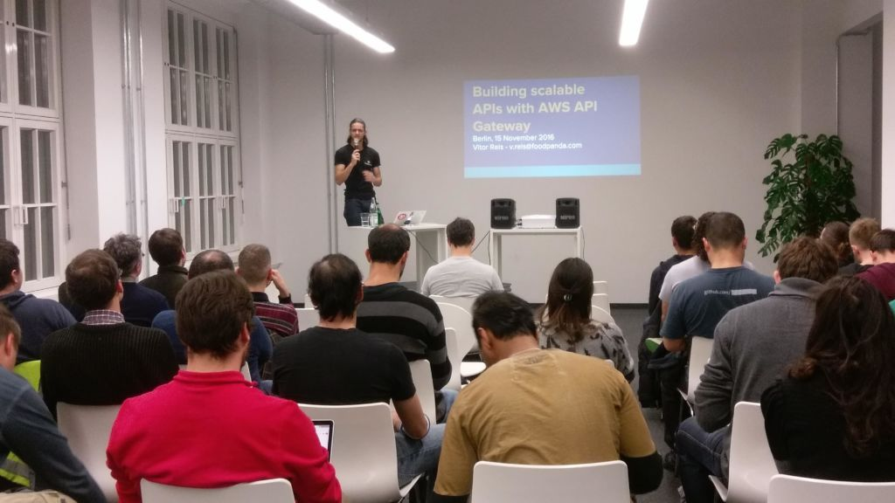
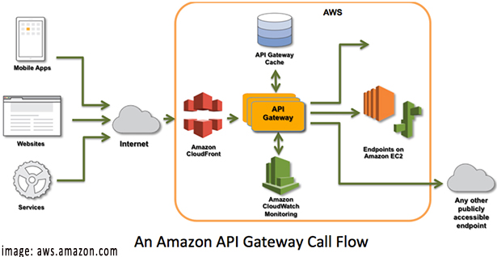

> Originally published at [foodora/foodpanda tech blog](https://tech.foodora.com/building-scalable-apis-with-aws-api-gateway)

We strongly believe that is important to keep up to date in our tech stack and be close to the tech community. Therefore foodpanda hosted the AWS User Group Berlin edition of November 2016.
At this event, we were invited to share our experience using serverless architecture with AWS API Gateway.

## About API Gateway

There is a lot of excitement around serverless architecture and it is for a good reason, abstracting the tedious details of configuration and management of your architecture can make a lot of sense for the right application, the AWS API gateway is one of the several tools that allow you this.

Amazon API Gateway is a fully managed service that makes it easy for developers to create, publish, maintain, monitor, and secure APIs at any scale, it handles all the tasks involved in accepting and processing up to hundreds thousands of concurrent API calls, including:

Traffic management
Authorization and access control
Monitoring
API version management

You pay only for the API calls you receive and the amount of data transferred out.

## Reasons to choose API Gateway

Speed and reduced infrastructure footprint are the 2 biggest reasons to choose to use API Gateway. When you choose API gateway all the servers, security, scaling and monitoring are managed for you.

The API gateway is designed for the developer who wants to quickly build APIs while reducing the cross team developing efforts and increase the time to market for your applications.

Good for:

- Greenfield projects
- Building MVP to quickly gauge customer interest
- Fast
- Minimal backend investment

## Reasons NOT to choose API Gateway

Since servers, security, scaling and monitoring are managed for you this means also that you don’t have many inputs of how those features are fulfilled. If your application has a unique constraint that can’t be fulfilled with the managed services, API Gateway may not be a good fit.

E.g.: If your application has the requirement of provide audit logs from the underlying hosting services, or, if you are in a specific security environment that does not allow hosted services.

If your organization has a strong, proven infrastructure and a DevOps organization that can provide similar services, introducing a new technology might not be good.

## Code and slides

The code samples are available on [GitHub](https://github.com/vitorreis/aws-examples) and [slides on google docs](https://docs.google.com/presentation/d/1E2r8cTIDqU2utB1UjRL08-j6GYefNVwVi_HMegpf1dA/edit).

